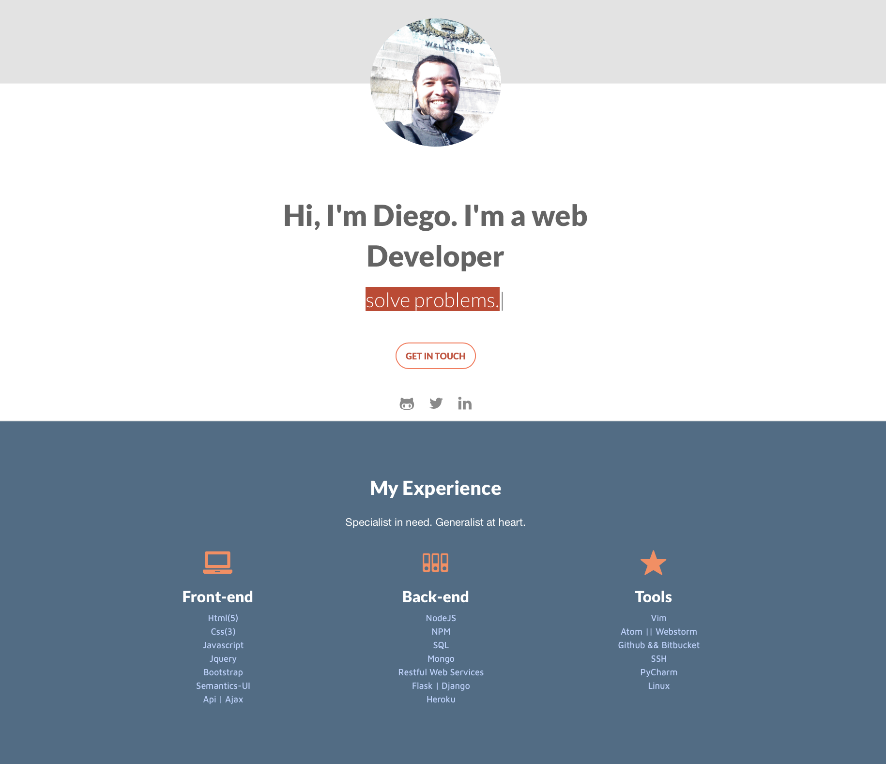

# Diego Gomes - Data Engineer & Software Developer Portfolio



> Modern and responsive portfolio showcasing my expertise in Data Engineering, Software Development, and Cloud Technologies.

This portfolio features a modern dark theme with interactive effects, optimized SEO, and responsive design. Built with cutting-edge web technologies and best practices.

## 🚀 Features

- **Modern Design**: Dark theme with futuristic visual effects
- **Interactive Elements**: Particle animations and smooth transitions
- **SEO Optimized**: Complete meta tags, Open Graph, and structured data
- **PWA Ready**: Progressive Web App capabilities
- **Responsive**: Mobile-first design approach
- **Performance**: Optimized loading and rendering

## 🛠️ Technologies Used

- **Frontend**: HTML5, CSS3, JavaScript (ES6+)
- **Libraries**: Particles.js, Font Awesome, Google Fonts
- **SEO**: Schema.org structured data, sitemap.xml, robots.txt
- **PWA**: Web App Manifest, service worker ready

## 📦 Installation

```bash
git clone https://github.com/digomes87/Diego-Gomes-web-developer.git
cd Diego-Gomes-web-developer

# Start local server
python3 -m http.server 8000
# or
npx serve .
```

## 🎯 About The Project

This portfolio showcases my professional journey as a Data Engineer and Software Developer with 18+ years of experience. It highlights my expertise in:

- **Data Engineering**: PySpark, Apache Spark, Databricks, ETL pipelines
- **Programming Languages**: Python, Java, Node.js, JavaScript, TypeScript
- **Cloud Platforms**: AWS, GCP, Docker, Kubernetes
- **Frameworks**: Django, Flask, FastAPI, React, Spring Boot
- **Databases**: PostgreSQL, MongoDB, Redis, Elasticsearch


## 🌐 Live Demo

- **Portfolio**: [https://digomes87.github.io/Diego-Gomes-web-developer/](https://digomes87.github.io/Diego-Gomes-web-developer/)
- **Source Code**: [https://github.com/digomes87/Diego-Gomes-web-developer](https://github.com/digomes87/Diego-Gomes-web-developer)

## 📊 Portfolio Highlights

- **Real-time Fraud Detection System**: Machine learning pipeline for financial fraud detection
- **NYC Taxi Data Analysis**: Large-scale data processing with PySpark and visualization
- **Cloud Data Pipeline**: Scalable ETL architecture on AWS
- **Bee Behavior Analysis**: Computer vision and data analysis for agricultural research
- **E-commerce Platform**: Full-stack development with modern frameworks

## 📱 Contact & Social

- **Email**: [diego.gomes87@gmail.com](mailto:diego.gomes87@gmail.com)
- **LinkedIn**: [linkedin.com/in/diego-go](https://linkedin.com/in/diego-go)
- **GitHub**: [github.com/digomes87](https://github.com/digomes87)
- **Location**: São Paulo, Brazil

## 🚀 Other Projects

- **Eventex**: [Django Event Management System](https://github.com/digomes87/wttd-eventex)
- **Data Engineering Projects**: Various ETL and analytics solutions
- **Machine Learning Models**: Fraud detection and predictive analytics

## 📄 License

This project is open source and available under the [MIT License](LICENSE).

---

⭐ **If you found this portfolio helpful, please give it a star!** ⭐
